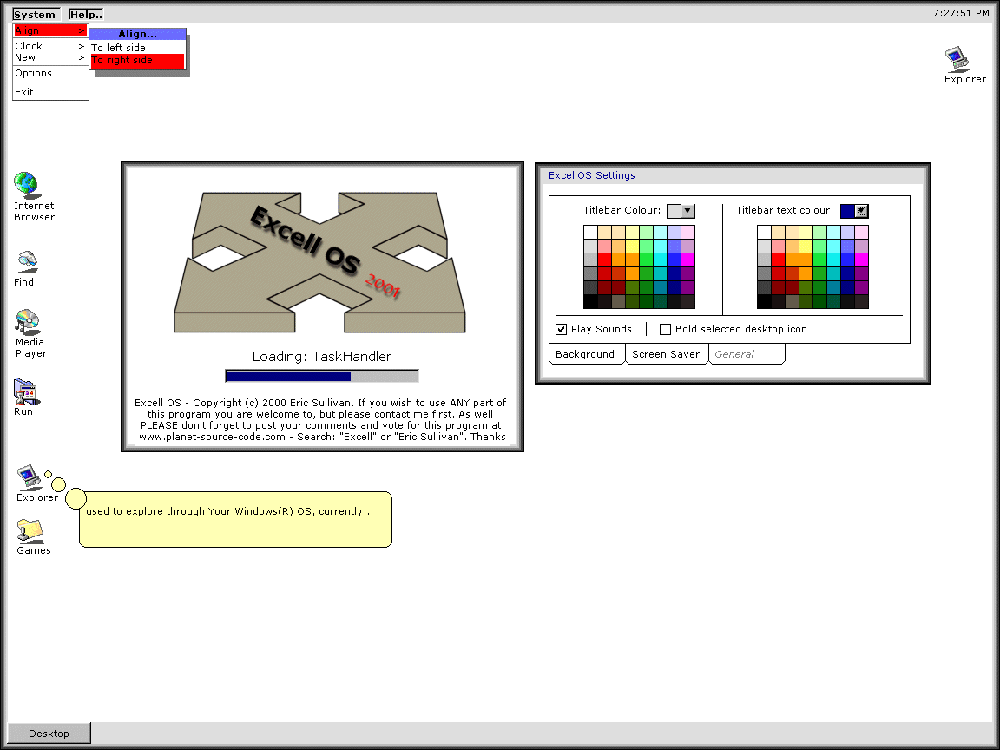



## Excell OS 20001

### Description

The newest version of Excell OS. Here is the list of newest features:

 

<li>Recycling Bin (Still doesn't work)

<li>TaskHandler (Still not impleminted)

<li>Desktop icon aligning

<li>Dynamic drop-down menu's

<li>New & improved system clock

<li>A Tooltip Helper

<li>Much, Much, More...!

 

Please vote and leave comments. If you would like to help me with this program please e-mail me (sullivaneric@hotmail.com)
 
### More Info
 

             |
---                |---
**Submitted On**   |2000-12-03 13:06:10
**By**             |[Eric Sullivan](https://github.com/Planet-Source-Code/PSCIndex/blob/master/ByAuthor/eric-sullivan.md)
**Level**          |Intermediate
**User Rating**    |4.5 (45 globes from 10 users)
**Compatibility**  |VB 6\.0
**Category**       |[Miscellaneous](https://github.com/Planet-Source-Code/PSCIndex/blob/master/ByCategory/miscellaneous__1-1.md)
**World**          |[Visual Basic](https://github.com/Planet-Source-Code/PSCIndex/blob/master/ByWorld/visual-basic.md)
**Archive File**   |[CODE\_UPLOAD123691252000\.zip](https://github.com/Planet-Source-Code/eric-sullivan-excell-os-20001__1-13355/archive/master.zip)

